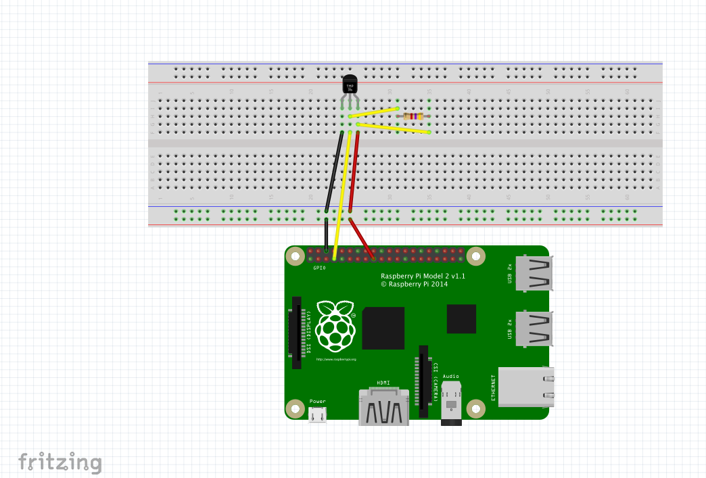

# Pi-eon

##DS18B20+ One Wire Digital Temperature Sensor and the Raspberry Pi

###introduction

Not another blog with a Pi and temperature sensor you think. But wait, this is different. This includes the Eon, which gives you the power to view the temperature readings in a beautiful graph that updates itself in real time. From anywhere in the world, with just a few lines of code. Real time dashboards, its happening! Who doesnt love a great visualization notifying you to switch on the air conditioning, when to WHAT ARE THE APPLICATIONS WITH EON? 

You are probably wondering how to get your hands on it. Eon is an open-source chart for realtime data. In this blog, I will explain how to use it to view real time temperature readings.  Lets get straight to it.

### what this sensor does?

I chose the DS18B20+ temperature sensor for this project. Its different from the other sensors like the motion sensor in that they have simple on/off outputs whereas in this it reads more complex temperature readings. Also, since they can be identified by a unique code for each of them, you can connect multiple units to the Pi at once. 

#### WHat will you need?

1.  The DS18B20+ : It has three pins: GND, Data (DQ), and 3.3V power line (VDD). 
2.  7 jumper wires (2 red, 2 black, 4 yellow)
3.  Breadboard and 
4.  4.7kΩ (or 10kΩ) resistor

### circuit diagram

Set up the circuit according to the following figure: 

### understanding the script to run the temperature sensor

Lets quickly go through the python script to see how to stream realtime temperature readings collected by the DS18B20+. 

'''
import os
import time
import sys
from Pubnub import Pubnub
pubnub = Pubnub(publish_key='demo', subscribe_key='demo')
channel = 'tempeon'

os.system('modprobe w1-gpio')
os.system('modprobe w1-therm')
temp_sensor = '/sys/bus/w1/devices/28-000006b4fef4/w1_slave'

def callback(message):
    print(message)

def temp_raw():
    f = open(temp_sensor, 'r')
    lines = f.readlines()
    f.close()
    return lines

def read_temp():
    lines = temp_raw()
    while lines[0].strip()[-3:] != 'YES':
        time.sleep(0.2)
        lines = temp_raw()
    temp_output = lines[1].find('t=')
    if temp_output != -1:
        temp_string = lines[1].strip()[temp_output+2:]
        temp_c = float(temp_string) / 1000.0
        temp_f = temp_c * 9.0 / 5.0 + 32.0
        
        #published in this fashion to comply with Eon
        pubnub.publish('tempeon', {
                'columns': [
                    ['x', time.time()],
                    ['temperature_celcius', temp_c],
                    ['temperature_farenheit', temp_f]
                    ]
                
            })
        return temp_c, temp_f
while True:
    print(read_temp())
    time.sleep(1)
'''
### What is Eon, ease of use
copy paste code
visualization easier than seeing a bunch of text
irrespective of the device or platform you are working on, just need a browser

### pubnub publishes to world with eon
all you have to do is include the eon script, works with the mobile web as well. 

### how does eon work to chart the real time graph
Explain the basic concepts of eon - the publish and subscribe

### applicatio

THIS IS EON. 
