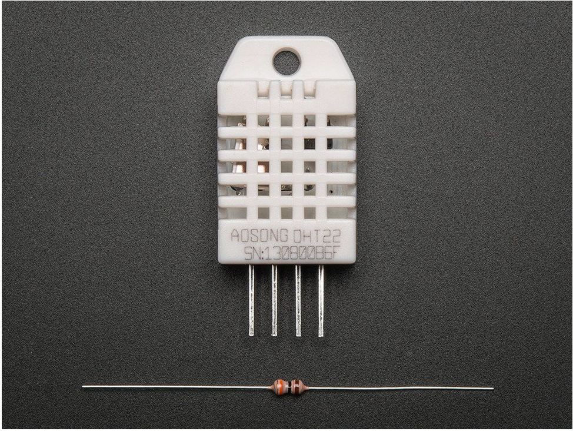
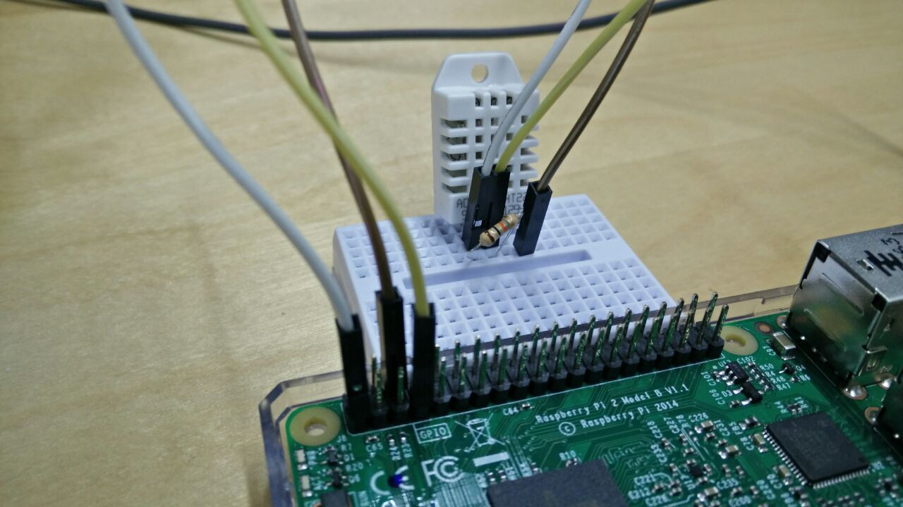

# Pi-eon

##DS18B20+ One Wire Digital Temperature Sensor and the Raspberry Pi

###introduction

Not another blog with a Pi and temperature sensor you think. But wait, this is different. This includes the Eon, which gives you the power to view the temperature readings in a beautiful graph that updates itself in real time. From anywhere in the world, with just a few lines of code. Real time dashboards, its happening! Who doesnt love a great visualization notifying you to switch on the air conditioning, when to WHAT ARE THE APPLICATIONS WITH EON? 

There are 3 parts to this blog;

1. The sensor that senses the temperature.
2. PubNub that lets you publish this value to a browser any where in the world.
3. Eon that is a Javascript library that allows you to chart the data automatically into a beautiful real time graph.

Lets not waste any more time and jump straight into it.


#### WHat will you need?

1.  The DHT22 sensor


2.  3 jumper wires (I have used 1 red, 1 black, 1 yellow)
3.  Breadboard  
4.  4.7kΩ (or 10kΩ) resistor
5.  Raspberry Pi 2 loaded with the Raspbian OS. 


## what this sensor does?

I chose the DHT22 for this project. The DHT22 is a basic, low-cost digital temperature and humidity sensor. It uses a capacitive humidity sensor and a thermistor to measure the surrounding air, and spits out a digital signal on the data pin.
Simply connect the first pin on the left to 3-5V power, the second pin to your data input pin and the right most pin to ground. 


### circuit diagram

Set up the circuit according to the following figure: 


which translates to 



I have connected to GPIO4 (pin7), pin 1 for the voltage (3v3) and pin 6 for ground. The resistor goes between the first two pins of the sensor. The third pin of the sensor need not be connected to anything.

### understanding the script to run the temperature sensor

Lets quickly go through the python script to see how to stream realtime temperature readings collected by the DHT22. In order to run PubNub on the Pi, you will have to run the following commands on your terminal.


Import the necessary libraries, and also PubNub to be able to send and receive messages to/from the Pi to any other device. 

####Installing PubNub


Open LXTerminal, and download and install the followings:

**Install Python:**
`pi@raspberrypi ~$ sudo apt-get install python-dev`

**Install pip:**
`pi@raspberrypi ~$ sudo apt-get install python-pip`

**install PubNub:**
`pi@raspberrypi ~$ sudo pip install pubnub`

For an in depth introduction to the Pi and PubNub, check this [blog](http://www.pubnub.com/blog/internet-of-things-101-getting-started-w-raspberry-pi/) by [Tomomi](ADD LINK TO HER BIO HERE)

Once you have installed PubNub on the Pi, you can use it by setting a pub/sub key and channel.

We need to use Adafruits DHT library to be able to read the temperature values from the sensor.

The Python code to work with Adafruit's DHT sensors is available on Github at https://github.com/adafruit/Adafruit_Python_DHT. 

**Downloading the Adafruit DHT liibrary:**
`pi@raspberrypi ~$ git clone https://github.com/adafruit/Adafruit_Python_DHT.git`
`pi@raspberrypi ~$ cd Adafruit_Python_DHT`

#### Code sample

We need to import the libraries required for this project. We also need to initialize a PubNub object and use the publish subscribe keys which you can get by [signing up for PubNub](https://www.pubnub.com/get-started/).

```
	import os
	import time
	import sys
	from Pubnub import Pubnub
	import Adafruit_DHT as dht
	pubnub = Pubnub(publish_key='Enter_your_publish_keys', 	subscribe_key='Enter_your_subscribe_keys')
	channel = 'tempeon'
```

#### The exciting part of the project : 

Using the `read.retry` method from the Adafruit_DHT library, we can obtain the temperature denoted by t and h respectively. 

The rest is just publishing these values in a way that **Eon** understands. We publish the temperaure on a channel called **temp_eon** and the humidity on **hum_eon**. This whole thing repeats till the program is terminated so this way you can get constant temperature and humidity readings. 

**PubNub** lets you view these readings remotely and with **Eon** you can create beautiful real time graphs in a matter of minutes. 

```     
def callback(message):
    print(message)

while True:
    h,t = dht.read_retry(dht.DHT22, 4)
    pubnub.publish('tempeon', {
        'columns': [
            ['x', time.time()],
            ['temperature_celcius', t]
            ]

        })
    pubnub.publish('humeon', {
        'columns': [
            ['humidity', h]
            ]

        })
```


### What is Eon, ease of use

So what is this magical Eon? PubNub's Project EON connects C3 charts and Mapbox's map widget to the [PubNub Data Stream Network](http://www.pubnub.com).

```
<script>
eon.chart({
	history: true,
    channel: 'tempeon',
    flow: true,
    generate: {
    	bindto: '#chart',
    	data: {
      		x: 'x',
      		labels: false
    	},
    	axis : {
      		x : {
        		type : 'timeseries',
        		tick: {
          			format: '%H:%M:%S'
        		}
      		}
    	}
  	}
});
</script>

```
copy paste code
visualization easier than seeing a bunch of text
irrespective of the device or platform you are working on, just need a browser


### pubnub publishes to world with eon
all you have to do is include the eon script, works with the mobile web as well. 

### how does eon work to chart the real time graph
Explain the basic concepts of eon - the publish and subscribe

### applicatio


THIS IS EON. 
