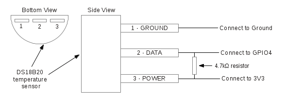

# Pi-eon

##DS18B20+ One Wire Digital Temperature Sensor and the Raspberry Pi

###introduction

Not another blog with a Pi and temperature sensor you think. But wait, this is different. This includes the Eon, which gives you the power to view the temperature readings in a beautiful graph that updates itself in real time. From anywhere in the world, with just a few lines of code. Real time dashboards, its happening! Who doesnt love a great visualization notifying you to switch on the air conditioning, when to WHAT ARE THE APPLICATIONS WITH EON? 

There are 3 parts to this blog;

1. The sensor that senses the temperature.
2. PubNub that lets you publish this value to a browser any where in the world.
3. Eon that is a Javascript library that allows you to chart the data automatically into a beautiful real time graph.

Lets not waste any more time and jump straight into it.


#### WHat will you need?

1.  The DS18B20+ : It has three pins: GND, Data (DQ), and 3.3V power line (VDD). 


2.
  7 jumper wires (2 red, 2 black, 4 yellow)
3.  Breadboard and 
4.  4.7kΩ (or 10kΩ) resistor
5.  Raspberry Pi 2 loaded with the Raspbian OS. 


## what this sensor does?

I chose the DS18B20+ temperature sensor for this project. Its different from the other sensors like the motion sensor in that they have simple on/off outputs whereas in this it reads more complex temperature readings. Also, since they can be identified by a unique code for each of them, you can connect multiple units to the Pi at once. 


### circuit diagram

Set up the circuit according to the following figure: 


### understanding the script to run the temperature sensor

Lets quickly go through the python script to see how to stream realtime temperature readings collected by the DS18B20+. In order to run PubNub on the Pi, you will have to run the following commands on your terminal.


Import the necessary libraries, and also PubNub to be able to send and receive messages to/from the Pi to any other device. 

####Installing PubNub


Open LXTerminal, and download and install the followings:

**Install Python:**
`pi@raspberrypi ~$ sudo apt-get install python-dev`

**Install pip:**
`pi@raspberrypi ~$ sudo apt-get install python-pip`

**install PubNub:**
`pi@raspberrypi ~$ sudo pip install pubnub`

For an in depth introduction to the Pi and PubNub, check this [blog](http://www.pubnub.com/blog/internet-of-things-101-getting-started-w-raspberry-pi/) by [Tomomi](ADD LINK TO HER BIO HERE)

Once you have installed PubNub on the Pi, you can use it by setting a pub/sub key and channel. 

#### Code sample

```
	import os
	import time
	import sys
	from Pubnub import Pubnub
	pubnub = Pubnub(publish_key='demo', subscribe_key='demo')
	channel = 'tempeon'
```


#### Understanding modprobe

The Raspberry Pi comes equipped with a range of drivers for interfacing. However, it’s not feasible to load every driver when the system boots, as it will increase the boot time significantly and use a considerable amount of system resources for redundant processes. These drivers are therefore stored as loadable modules and the command modprobe is employed to boot them into the Linux kernel when they’re required. The following two modprobe commands load the 1-Wire and thermometer drivers on GPIO 4.

```
	os.system('modprobe w1-gpio')
	os.system('modprobe w1-therm')
```

The sensor is identified by a unique serial number present in your device driver. In this case, the device is registered as 28-000006b4fef4. You need to replace this serial number with your own. This can be accessed by typing 

`cd /sys/bus/w1/devices/`

The sensor then writes it readings into a file provided by the following path. In our code, we access it using a variable to store the path to a file called tempstore 

```
	temp_sensor = '/sys/bus/w1/devices/28-000006b4fef4/tempstore'	
```


```

	def callback(message):
   		print(message)
```		

The sensor sends out readings to the tempstore file in a very specfic fashion : 
```
72 01 4b 46 7f ff 0e 10 57 : crc=57 YES

72 01 4b 46 7f ff 0e 10 57 t=23125   
```

Where the last value `t=23125` is the temperature value. A decimal point has to be placed after the first two digits.

The following code just manipulates the above two lines to display just the temperature value in a more readable fashion. We then convert it to faranheit as well. 

```
	def temp_raw():
    	f = open(temp_sensor, 'r')
    	lines = f.readlines()
    	f.close()
    	return lines

	def read_temp():
    	lines = temp_raw()
    	while lines[0].strip()[-3:] != 'YES':
        	time.sleep(0.2)
        	lines = temp_raw()
    	temp_output = lines[1].find('t=')
    	if temp_output != -1:
        	temp_string = lines[1].strip()[temp_output+2:]
        	temp_c = float(temp_string) / 1000.0
        	temp_f = temp_c * 9.0 / 5.0 + 32.0
```

#### The exciting part of the project : 


```     
        	pubnub.publish('tempeon', {
                	'columns': [
                    	['x', time.time()],
                    	['temperature_celcius', temp_c],
                    	['temperature_farenheit', temp_f]
                    	]
                
            	})
```
        	return temp_c, temp_f
    

	while True:
    	print(read_temp())
    	time.sleep(1)
```
### What is Eon, ease of use
copy paste code
visualization easier than seeing a bunch of text
irrespective of the device or platform you are working on, just need a browser


### pubnub publishes to world with eon
all you have to do is include the eon script, works with the mobile web as well. 

### how does eon work to chart the real time graph
Explain the basic concepts of eon - the publish and subscribe

### applicatio


THIS IS EON. 
